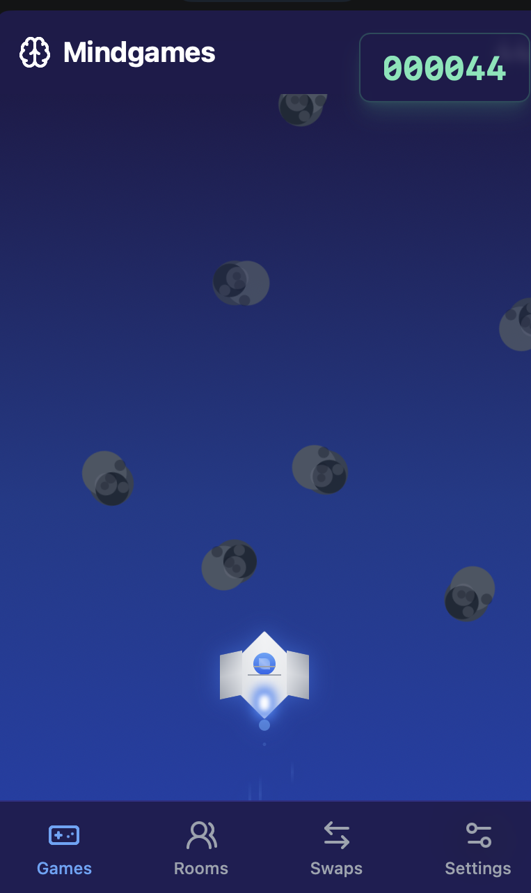

# Welcome

$MIND is first community-led gaming platform powered by the $MIND protocol.&#x20;

Joinn a groundbreakings GamiFi adventure set within Telegram's platform leveraging the Coreum blockchain.

<figure><figcaption></figcaption></figure>

### Jump right in

<table data-view="cards"><thead><tr><th></th><th></th><th data-hidden data-card-cover data-type="files"></th><th data-hidden></th><th data-hidden data-card-target data-type="content-ref"></th></tr></thead><tbody><tr><td><strong>Getting Started</strong></td><td>Create your first site</td><td></td><td></td><td><a href="getting-started/how-to-play.md">how-to-play.md</a></td></tr><tr><td><strong>Basics</strong></td><td>Learn the basics of GitBook</td><td></td><td></td><td><a href="broken-reference">Broken link</a></td></tr><tr><td><strong>Publish your docs</strong></td><td>Share your docs online</td><td></td><td></td><td><a href="getting-started/in-game-controls.md">in-game-controls.md</a></td></tr></tbody></table>
