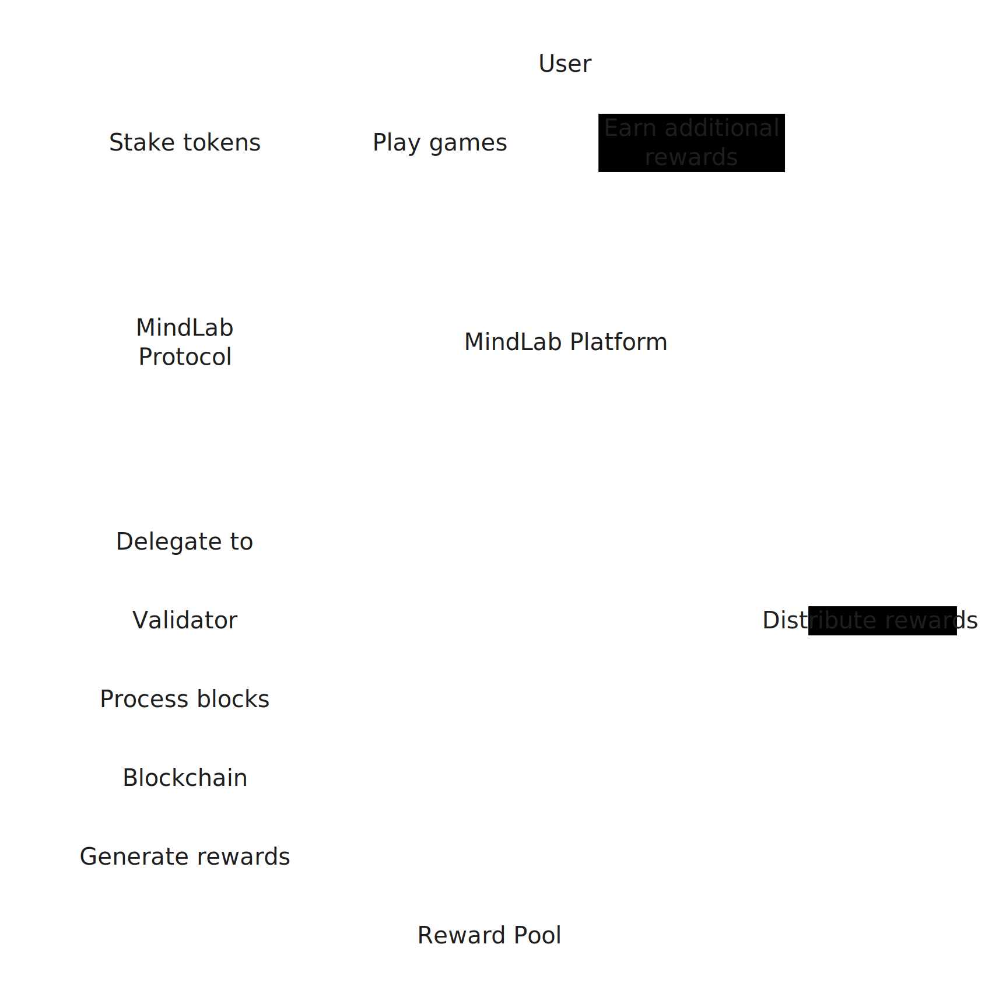

# Validator

We run a validator on the Coreum Network.&#x20;

### Rewards are being redistributed&#x20;



### Tabs







Each tab is like a mini page — it can contain multiple other blocks, of any type. So you can add code blocks, images, integration blocks and more to individual tabs in the same tab block.



Add images, embedded content, code blocks, and more.

```javascript
const handleFetchEvent = async (request, context) => {
    return new Response({message: "Hello World"});
};
```



### Expandable sections

<details>

<summary>Click me to expand</summary>

Expandable blocks are helpful in condensing what could otherwise be a lengthy paragraph. They are also great in step-by-step guides and FAQs.

</details>

